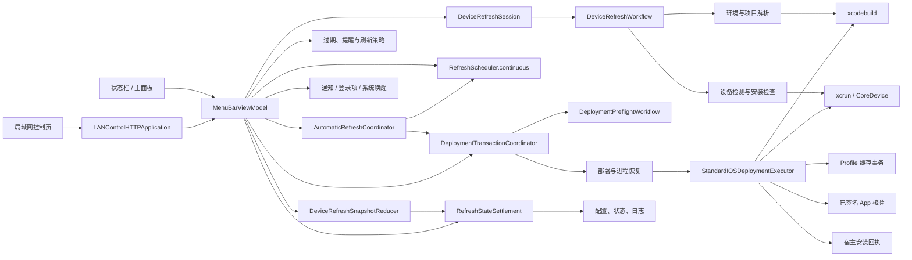
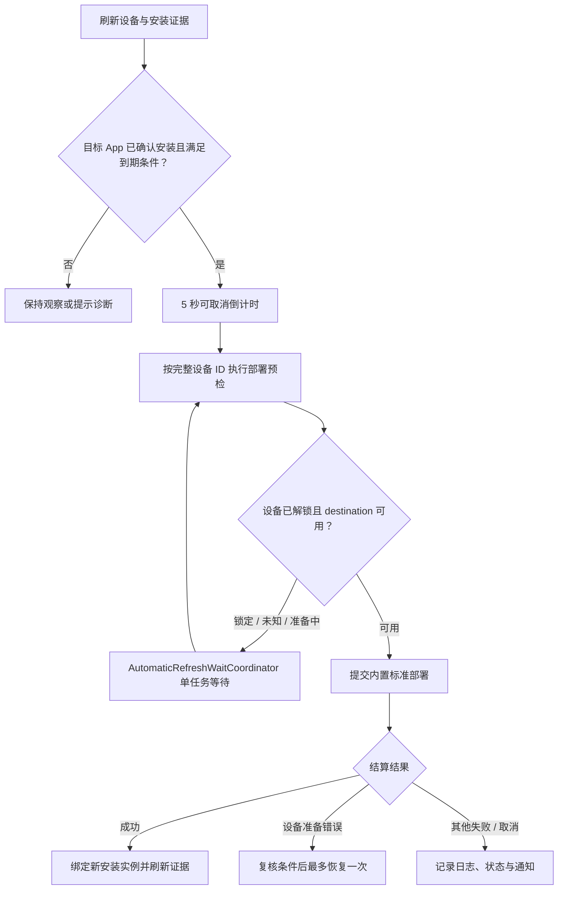

# iOSSignKit 项目架构

本文只记录当前稳定的系统边界、运行时关系和业务不变量。具体开发、构建与验收约束见项目根目录 [`AGENTS.md`](../AGENTS.md)，界面规则见 [`ui-guidelines.md`](ui-guidelines.md)。代码、契约测试和实际运行行为优先于历史方案文档。

## 1. 系统定位

iOSSignKit 是基于 Swift 6.3、SwiftUI 和 AppKit 的 macOS 菜单栏应用，最低运行目标为 macOS 14。它负责检查目标 iPhone、推断指定 App 的个人签名有效期，并在满足策略时提醒或直接编排 Xcode 完成重新签名与真机安装；用户显式启用后，也可从经认证的局域网页面查看状态并发起受控操作。

本仓库不内建完整的 iOS 构建工程，也不替代 Xcode。系统边界是：

- iOSSignKit 负责目标解析、设备证据、策略、安全预检、Xcode 构建编排、签名产物核验、真机安装、反馈和审计。
- 外部 iOS 项目只需提供标准 Project/Workspace、可发现的 Scheme 和自动签名 iOS App Target，不需要 iOSSignKit 专用脚本。
- Xcode、`xcrun`、CoreDevice、系统通知和登录项是外部运行依赖。

## 2. 代码组织

| 目录 | 职责 |
| --- | --- |
| `Sources/IOSSignKit` | 应用入口、AppDelegate 和状态栏控制器 |
| `Sources/IOSSignKit/Models` | 配置、运行状态、设备、安装与过期等领域数据 |
| `Sources/IOSSignKit/ViewModels` | 主协调器、配置流程和类型化展示模型 |
| `Sources/IOSSignKit/Workflows` | 设备刷新会话、部署事务和自动刷新等有状态工作流模块 |
| `Sources/IOSSignKit/State` | 运行状态事件的集中结算与持久化转换 |
| `Sources/IOSSignKit/Services` | 环境、设备、项目解析、命令、部署、持久化和系统集成 |
| `Sources/IOSSignKit/Views` | 主面板、页面和 SwiftUI 组件 |
| `Sources/IOSSignKit/Views/Theme` | 颜色、字体、间距和动效令牌 |
| `Sources/IOSSignKit/Resources/LANControlWeb` | 局域网控制页的 HTML、CSS 与 JavaScript 静态资源 |
| `Sources/IOSSignKit/Debug` | 仅 Debug 可用的确定性 Visual QA 场景 |
| `Tests/IOSSignKitTests` | 领域规则、服务边界、恢复与展示契约测试 |
| `scripts` | 构建、安装、产物验收、并发测试、空间审计、公开源码检查和双镜像推送脚本 |
| `config` | 发布元数据和运行时资源清单 |

Swift Package 产品名为 `IOSSignKit`，标准发布 App 的展示名为 `iOSSignKit`。

## 3. 运行时总览

`MenuBarViewModel` 是 SwiftUI façade，发布界面需要的状态、接收用户意图并编排工作流模块。设备刷新主任务、部署生命周期、自动倒计时与等待、状态结算分别由深模块拥有；ViewModel 仍负责把工作流结果适配到系统通知、菜单栏和页面展示。可独立判断的行为保留在策略对象、纯转换和类型化 Presentation 中，以便通过模块接口测试和复用。

`RefreshScheduler` 是刷新链路唯一的业务时间边界，同时提供当前墙钟时间和可取消等待。生产环境统一使用 `continuous` adapter；测试使用手动 adapter 显式推进虚拟时间。自动刷新倒计时、自动等待、系统唤醒补检、连接确认和安装检查重试不得再各自注入互不关联的时钟或休眠闭包。

## 4. 启动与生命周期

启动路径如下：

1. `IOSSignKitApp` 建立 SwiftUI 应用入口并接入 `AppDelegate`。
2. `AppDelegate` 获取 `ApplicationInstanceLock`，阻止同一用户会话中多实例并发；真实 App 入口随后执行普通命令和部署前缀的全局遗留扫描。
3. `AppBootstrapper` 加载配置与运行状态，并清除旧配置中的 `deployScriptPath`。存在精确部署令牌时，`DeploymentProcessRecovery` 先按令牌确认所有相关进程组已经终止或不存在。
4. 只有进程恢复已确认时，启动恢复才继续按精确令牌执行“构建工作区清理 → Provisioning Profile 缓存恢复 → 宿主安装回执核对”。Profile 或回执失败时保留令牌并阻断新续签；工作区清理失败只追加有界警告。
5. 完成基础环境校验，初始化设备检测策略、`SystemWakeMonitor`、`MenuBarViewModel` 和 `StatusBarController`。
6. 预加载主面板并触发首次环境、设备和安装状态刷新。

主窗口平时由状态栏控制器持有。左键菜单栏图标打开或恢复窗口；窗口关闭后应用继续以菜单栏形态运行。单实例锁、遗留进程所有权和登录项是不同层面的约束，不能互相替代。

## 5. 状态与展示分层

### 5.1 持久化事实

`AppConfig` 保存项目目标、固定设备、到期前/到期后检查频率、提醒冷却、登录启动、自动续期策略和局域网控制配置。局域网控制密码只以带随机盐的迭代摘要持久化，不保存明文。`AppState` 保存与当前设备、Bundle ID、安装实例绑定的运行证据、自动化状态和诊断事件。

持久化数据不是永久真相。目标设备、Bundle ID、安装实例或配置代次变化时，旧证据必须失效，不能跨目标恢复到期判断或授权部署。

### 5.2 会话状态

会话状态按所有权拆分：

- `DeviceRefreshSession` 持有设备刷新主任务与扫描代次；被新请求取代或取消的任务仍由会话保留到真正结算，避免任务脱离所有者后继续回写。`DeviceRefreshWorkflow` 接收不可变请求，完成环境验证、检测策略选择、设备扫描、目标匹配、安装检查和缓存更新，并返回不修改界面的类型化转移结果。连接确认和安装检查重试使用独立任务，候选缓存由 `RefreshSessionCaches` 统一失效。
- `DeploymentTransactionCoordinator` 持有部署预检任务、已授权运行进程、事务上下文和取消/终止转移；取消或清空预检只释放业务占用状态，协调器仍跟踪原任务直到闭包返回。输出收集由部署支持类型隔离。
- `DeploymentPreflightWorkflow` 以固定顺序完成最终设备复核、锁态、静态环境、App 目标、Xcode destination、自动安装身份和提交前二次解锁校验，返回已授权目标或类型化阻断结果；ViewModel 只负责展示、等待调度与真正的进程提交。
- `AutomaticRefreshCoordinator` 持有倒计时并组合 `AutomaticRefreshWaitCoordinator`，保证自动路径只有一个倒计时和一个等待探测循环。
- `MenuBarViewModel` 持有系统事件适配、历史分页、界面选择和类型化工作流结果的展示投影，不再保存上述主任务的平行状态。

异步结果跨模块回写前必须核对目标代次、检测策略代次和安装实例，丢弃已经过时的任务结果。

测试 fixture 或其他非 App 生命周期宿主结束前必须调用所属对象的结算入口：先取消倒计时、等待、刷新、部署预检、通知和辅助任务，再等待已取消或被取代的任务返回。不得只清空任务引用而让工作继续占用 Main Actor。

### 5.3 状态结算

`DeviceRefreshSnapshotReducer` 将设备刷新快照与当前会话状态归约为单一应用计划，联合决定连接阶段、安装身份、有效期、缓存失效和关键动作抑制；模块不调度任务、不发送通知，也不直接修改界面。`RefreshStateSettlement` 集中处理设备观察、安装身份和部署结果到 `AppState` 的字段映射。调用方通过类型化事件描述部署启动、进程归属、观察结果、提醒送达和证据失效，模块以“先复制、再原子保存、最后发布”的顺序提交状态。持久化失败时保留旧状态并进入可见阻断；新增跨字段不变量应优先落在这两个归约模块，而不是继续散落到 ViewModel 分支。

### 5.4 展示模型

视图优先消费类型化展示模型，而不是在 SwiftUI `body` 内重新组合业务条件：

- `PrimaryJourneyPresentation`：状态页主旅程和安全主动作。
- `OperationActivityPresentation`：检查、倒计时、部署、恢复和结算反馈。
- `MenuBarStatusPresentation`：菜单栏短标题和状态。
- `StatusMenuHeaderPresentation`：右键菜单顶部摘要。
- `RemainingExpiryPresentation`：有效期主数字和辅助文本。
- `RenewalIconPresentation`：续期环颜色与运动阶段。
- `DeviceStatusPresentation`、`VerificationTimePresentation`：设备和检查证据文案。

展示模型只能解释已有领域事实，不能绕过服务层直接授权提醒、配对或部署。

## 6. 环境与项目解析

目标项目解析由三个边界共同完成：

- `EnvironmentValidator` 检查项目根目录、`xcodebuild` 和 `xcrun` 的基础条件；旧配置中的脚本路径不参与完整性判断。
- `XcodeProjectLocator` 递归发现 `.xcodeproj` 与 `.xcworkspace`，排除隐藏目录、依赖目录、构建产物和 Project 内部生成的重复 Workspace。
- `XcodeProjectResolver` 使用 `xcodebuild -list -json` 和 `-showBuildSettings -json` 解析真实 Scheme、`iphoneos` App Target 与 Bundle ID；混合平台 Workspace 中可以跳过可确认不含 iOS App 的 Scheme，但命令超时、截断或进程树未结束不能被当作“非 iOS”。

可部署目标由项目根目录、Project/Workspace 路径、Scheme、Target 和 Bundle ID 共同标识。最终 Build Settings 必须唯一匹配产品类型 `com.apple.product-type.application`、`iphoneos`、自动签名和有效 Development Team；任一关键字段缺失或不一致都必须在安装前失败，禁止回退其他候选。

Swift、SwiftUI 或 Objective-C 不是能力边界；是否生成可独立安装的 iOS `.app` 才是边界。纯 Framework、Library 或 Swift Package Target 不得作为续签目标。

同一项目根目录解析出多个 App 候选时，设置页必须要求用户选择明确的 Scheme、Target、Bundle ID 和工程组合。若已有配置与候选存在唯一精确匹配，可以恢复该选择；否则不得猜测或静默选择第一个候选。

## 7. 设备检测与证据合并

`DeviceMonitor` 以小接口协调来源扫描、纯解析、证据融合和部署授权。`DeviceSourceScanner` 执行 `xcdevice` 与 `devicectl`，来源解析器只负责结构解码和归一化，`DeviceMonitor` 的融合层合并同一轮证据，`DeploymentTargetAuthorizer` 只在完整且一致的证据上构造正式 `DeploymentTarget`。来源结果区分完整、部分和失败，传输层不确定性不能被压缩为“设备全局不可用”。

设备检测策略由 `DeviceDetectionRolloutController` 和 `DeviceDetectionRolloutConfiguration` 集中控制：

- `fallback`：使用兼容检测路径。
- `shadow`：主路径执行，同时记录对照差异。
- `readOnly`：只读核验，禁止部署。
- `production`：使用正式检测路径，生产默认值。

环境变量 `IOS_SIGN_KIT_DEVICE_DETECTION_POLICY` 只接受以上四值。非法非空值必须失败关闭到 `readOnly` 并显示诊断，不能猜测用户意图。

设备安全不变量：

- `DeviceMatcher` 优先匹配稳定设备 ID；固定 ID 缺失时不回退名称。
- 同名设备视为歧义，不能构造部署目标。
- `DeviceConnectionReducer` 独占连接确认暂态，避免多个扫描来源各自改变全局状态。
- `RefreshSessionCaches` 只用于候选筛选，不能直接授权提醒、配对、倒计时或部署。
- 设置页设备扫描与部署前检测必须遵循同一检测策略。
- 预检期间切换策略立即取消预检；已运行的部署在结算后再应用切换。

## 8. 安装状态与过期推断

`DeviceAppInspector` 查询目标 App 是否安装，并读取可用的安装元信息。过期时间由 `ExpiryInspector` 按以下顺序推断：

1. 当前安装元信息中的 `expectedExpiryAt`。
2. 与当前目标绑定的 `lastDetectedExpiryAt`。
3. 当前安装实例的最近成功时间加个人签名有效期 7 天。

目标 App 的 `install-metadata.json` 是可选证据，不是部署依赖。内置部署会在安装前直接从已签名 `.app` 的嵌入 Profile 得到精确到期时间，并在 `installed` 宿主回执和状态结算中绑定设备、Bundle、版本、Build 与 Profile。启动恢复只有在精确令牌、当前设备和 Bundle 全部匹配时才能用该回执重建成功状态。

第一次接管既无可验证安装元信息、也无宿主回执的既有安装时，可以确认 App 是否存在并执行续签，但旧安装的精确 Profile 到期时间可能未知；首次内置续签成功后不再依赖目标 App 写专用元数据。

历史记录的 `lastSuccessAt` 只用于展示和审计。App 已确认卸载、安装身份变化或目标切换后，不得用历史成功恢复当前安装实例的过期推断。

连续两次成功检查均未发现目标 App 时，清除当前安装实例的过期证据，并停止自动提醒、自动续期和自动配对；手动操作仍需明确确认。

## 9. 检查、提醒与自动续期

`RefreshPolicy` 决定后台心跳、App 补查和完整交互检查；`ReminderPolicy` 根据在线状态、安装状态、过期时间、冷却和部署状态判断提醒或自动续期资格。

默认策略：

- 每 `5` 分钟检查一次。
- 已确认签名到期后每 `1` 分钟检查一次。
- 提醒冷却 `24` 小时。
- 到期时提醒，不默认自动续期。
- 不默认启用局域网控制。

自动续期主流程：

等待节奏由 `AutomaticRefreshWaitCoordinator` 统一管理：设备已锁定每 `30` 秒、锁态未知每 `60` 秒、Xcode destination 准备中每 `120` 秒；连续等待超过 `2` 小时后统一为 `300` 秒。Mac 唤醒后优先在 `+5` 和 `+20` 秒补检。

普通轮询、系统唤醒和用户`重新检查`共用等待期间的单一探测循环，任一时刻最多一个锁态探测或部署预检。只有部署进程即将真实启动时才记录自动尝试时间。

自动初次部署明确返回 `device_preparation_required` 时，在重新核对设备、配置、安装实例、策略和到期条件后最多恢复一次；再次失败至少退避 `10` 分钟。手动刷新和恢复尝试本身不能递归重试。

## 10. 部署边界

`DeployService` 是业务层 façade，把已解析配置和已授权 `DeploymentStartTarget` 转换为 `StandardIOSDeploymentRequest`；它不执行目标仓库中的命令文件。`StandardIOSDeploymentExecutor` 持有完整部署流水线：

1. 标准化并核验项目根目录、Project/Workspace、Scheme、Target、Bundle ID、设备稳定 ID 和精确部署令牌。
2. 在 `~/Library/Caches/iOSSignKit/Deployments/<令牌>/DerivedData` 建立权限为 `0700` 的私有工作区，通过 `xcodebuild -showBuildSettings -json` 确认唯一 `iphoneos` App 产物、自动签名和 Development Team。
3. `ProvisioningProfileCacheManager` 在两个标准 Profile 缓存目录中开启 Team + Bundle 精确事务；`auto` 只隔离已过期匹配项，`force` 隔离全部匹配项。
4. 使用完整设备 ID、受控 DerivedData、`-allowProvisioningUpdates` 和 `-allowProvisioningDeviceRegistration` 直接执行 `xcodebuild build`。
5. `SignedIOSAppInspector` 在安装前核验唯一 `.app` 的路径、Info、可执行文件、Bundle ID、代码签名、Team、嵌入 Profile、设备授权、摘要和精确到期时间；`force` 不允许复用事务前 Profile 摘要。
6. `HostInstallReceiptStore` 先写 `prepared` 回执，再执行 `xcrun devicectl device install app --device <稳定 ID>`；完整成功后立即写 `installed`，提交 Profile 事务，最后尝试启动 App。

构建设置、Build、Install 和 Launch 的有限超时分别为 `60` 秒、`30` 分钟、`5` 分钟和 `60` 秒。stdout 与 stderr 各自最多持久化 `8 MiB` 首尾转录，实时输出不因持久化截断而停止。Launch 失败只产生“已安装但未自动启动”诊断，不推翻已核验的安装成功。

Profile 缓存属于用户级共享状态，恢复必须服从部署进程所有权：只有完整进程树确认结束后才能 rollback。超时、取消或失败若仍有未确认进程，则事务保持 active、部署令牌保留，并由下次启动在进程恢复完成后处理；不能为了快速返回而与仍运行的 Xcode 进程并发恢复 Profile。

## 11. 命令所有权与异常恢复

命令模块按执行 façade、运行进程、所有权跟踪和输出收集组织。`CommandRunner` 与 `RunningCommand` 负责启动和生命周期，`CommandProcessOwnershipTracker` 负责逻辑令牌、持久化 marker 与 FD 198，`CommandOutputCollector` 负责有界输出和增量 UTF-8 解码。内置部署的 `xcodebuild`、`security`、`codesign` 和 `devicectl` 阶段均使用同一命令模块；精确部署令牌跨阶段保持稳定，即使阶段切换产生多个进程组也属于同一部署事务。

- 正常取消采用 `TERM → KILL`。
- 进程即使改变会话或进程组，只要仍继承所有权标记和精确部署令牌，仍可被识别；同一令牌下的多个进程组需要统一结算。
- 应用异常退出后，下次启动只清理归属可精确证明的遗留进程。
- 无法核验或终止时保持刷新阻断，不能为了恢复可用性误杀无关进程。
- 前缀扫描只用于发现不确定遗留进程，不得据此终止；进程名中仅出现令牌文本也不能证明归属。
- 精确进程恢复完成后才允许清理同令牌构建工作区、恢复 Profile 事务和消费宿主回执；Profile 或回执损坏、错配时失败关闭并保留令牌。
- 普通命令恢复和部署恢复分别处理，不以单一“运行中”布尔值代替。

这些标识都是 iOSSignKit 内部契约，目标仓库无需读取或转发。测试夹具和未来的命令 adapter 不得主动关闭 FD 198、改写部署令牌或把前缀匹配提升为终止授权。

## 12. 数据存储与系统集成

应用数据位于用户 Application Support：

- `iOSSignKit/config.json`：用户配置。
- `iOSSignKit/state.json`：运行状态、安装证据和最多 `50` 条自动化诊断事件。
- `iOSSignKit/logs/`：部署日志，默认最多 `200` 份、合计不超过 `256 MiB`，且至少保留最新一份。
- `iOSSignKit/Install Receipts/`：按精确部署令牌保存带 SHA-256 的 `prepared` / `installed` 宿主回执；单份最多 `64 KiB`，默认最多 `200` 份、合计不超过 `8 MiB`。
- `iOSSignKit/Provisioning Profile Backups/`：Profile 缓存事务备份、原路径映射、摘要和恢复清单；只允许精确令牌恢复。
- `.instance.lock`：同一用户会话的单实例锁。

部署工作区不进入 Application Support，而位于用户缓存目录 `~/Library/Caches/iOSSignKit/Deployments/<部署令牌>/`。工作区、Profile 事务目录与回执目录必须为 `0700`，敏感清单和回执文件必须为 `0600`；清理只接受规范部署令牌指向的直接子目录，不跟随符号链接。

`RefreshStateStore` 负责配置与运行状态持久化，`LogStore` 负责日志保留，`RefreshHistoryService` 分页提取历史摘要。写入失败必须作为可见诊断处理，不能假装状态已经持久化。

局域网控制边界：

- `LANControlServerController` 使用 Network.framework 管理 TCP 监听，只接受回环、链路本地、私有 IPv4、`.local` 和本地 IPv6 来源；服务默认关闭，端口限制为 `1024...65535`。
- `LANControlHTTPApplication` 提供静态资源、密码登录、一次性配对、状态读取、重新检查与续签接口。登录会话只保存在内存中并在 `8` 小时后失效；配对令牌 `120` 秒后失效且消费一次即删除，关闭服务或修改凭据会清空二者。
- 服务只提供 HTTP，因此认证能力不能被描述为传输加密；用户界面和文档必须明确其仅适合受信任的本地网络。
- 控制页只消费 `LANControlSnapshot` 并提交 `LANControlAction`。远程动作经 `MenuBarViewModel` 进入现有状态判断；需要现场选择 Profile 策略时拒绝远程续签，浏览器不能构造部署目标、跳过预检或直接调用部署服务。

系统集成边界：

- `LaunchAtLoginService` 优先使用 `SMAppService.mainApp`；系统找不到主 App 服务或明确拒绝签名时，才回退到直接启动具名 App 可执行文件的用户 LaunchAgent。
- LaunchAgent 不得调用 `/usr/bin/open`、shell或脚本作为系统后台项身份。
- `NotificationService` 在 App 环境使用 UserNotifications；非 App 运行环境可回退到带退出状态校验的 `osascript`。
- `SystemWakeMonitor` 在唤醒后清理旧设备证据并协调补检，不取消已经运行的部署。

## 13. 主面板与状态栏

`StatusBarController` 负责 AppKit 生命周期、菜单栏状态项、原生右键菜单和主窗口显示隐藏。`MainPanelView` 只保留`状态 / 历史 / 设置`三个一级页面；设置页再按`目标 / 续期 / 局域网 / 通用`四个分类组织内容。前三类配置草稿通过固定保存栏统一提交；`通用`中的登录启动直接同步系统服务，诊断动作也不进入草稿。具体视觉和交互契约见 UI 规范。

菜单栏、主面板和系统通知消费同一业务状态，但使用各自的 Presentation。它们不能各自重新判断设备是否可部署，也不能因某个表面关闭提示而改变持久化状态。

## 14. 构建、资源与发布

项目以 Swift Package 为主入口，不以 `.xcodeproj` 作为仓库工程事实源。

- `scripts/build-app.sh` 构建并组装标准 `.app`，默认 release；显式传入 `dmg` 才生成 DMG。
- `config/release-metadata.json` 是展示名、可执行名、Bundle ID、版本和最低系统版本的发布元数据事实源。
- 根目录 `AppIcon.icon` 是正式 App Icon 的唯一打包源。
- `config/runtime-resources.tsv` 是通知附件和局域网页面静态文件等运行时资源的边界；打包、测试和产物验收共同消费该清单。
- `scripts/verify-release-artifacts.sh` 验证签名、图标、资源边界、压缩格式、卷结构和体积。

GitHub `master` 是仓库唯一的日常开发事实源；私有仓库只镜像同一提交图和相同 OID，迁移前的私有历史保存在独立只读备份中。所有 Git 跟踪文件、提交消息和提交身份都属于公开源码边界，`scripts/verify-public-source.sh` 只接受完整且没有 replacement refs 或 grafts 的仓库，对目标提交及其全部可达历史执行只读检查，并要求作者与提交者使用 GitHub noreply 邮箱。`scripts/push-source-mirrors.sh` 在检查前冻结本地提交和两端实际 push URL，按语义归一化识别等价 GitHub URL，拒绝 Git URL 重写并在每个网络阶段前持续复核 remote 配置；网络 Git 子进程隔离仓库、全局和系统配置，禁用本地 hook、自动标签与递归子模块推送。脚本在写入前预检 GitHub `origin` 与私有 `private`，随后按私有镜像、GitHub 的顺序只推送目标 `master`，并通过冻结的实际 push URL 复核两端 OID；本地分支、提交、工作区或 remote URL 在运行期间变化时停止。两端写入不是原子事务，任何部分成功都必须返回非零且禁止自动 force、pull、merge 或 rebase。

## 15. 核心不变量

修改架构时优先保持以下契约：

1. 固定设备 ID 缺失或歧义时禁止部署，不回退到名称猜测。
2. 只有唯一精确匹配的 `iphoneos` App Target 可以部署；Framework、Library 和其他容器候选不能被静默提升为可安装目标。
3. 缓存和历史只帮助筛选或展示，不能授权提醒、配对或部署。
4. 目标、Bundle ID、安装实例和策略代次变化后，丢弃旧异步结果与旧过期证据。
5. 自动路径在锁态未知或 destination 无法确认时失败关闭；手动路径只能在展示诊断后继续。
6. 提交部署前再次核验设备和配置，只有真实提交才消耗自动尝试冷却。
7. Profile 缓存只按 Team + Bundle 精确事务处理；进程树未确认结束时不得 rollback 或清理部署工作区。
8. 安装成功必须来自核验后的产物和完整 `devicectl install` 结果；跨崩溃恢复还必须核对精确令牌、设备、Bundle 与 `installed` 回执。
9. 当前操作、历史记录和通用反馈互相隔离，不能继承错误动作。
10. 遗留进程只有在所有权可证明时才终止，无法确认时阻断新部署。
11. UI、菜单栏、通知和日志共享事实，不各自实现一套业务判断。
12. 登录项始终显示可识别的 App 身份，并直接启动稳定具名可执行文件。
13. 文档只描述当前稳定架构，不用开发阶段名称保存并行事实源。
14. 局域网控制默认关闭且不能扩大部署授权；未经认证、需要现场策略选择或既有预检不通过时都不得开始续签。

## 16. 测试与变更落点

测试使用 Swift Testing，重点覆盖环境与目标解析、设备来源合并、匹配安全、到期推断、提醒策略、自动等待、部署恢复、进程所有权、持久化、历史摘要和展示模型。

普通异步工作流测试通过 `ManualRefreshScheduler` 显式推进业务时间，并优先等待 collaborator 的类型化事件或任务结算接口。正向断言不得用真实毫秒休眠或墙钟 deadline 轮询状态；负向断言应在调度队列排空且所属任务结算后检查事件快照。允许使用独立、宽松的真实时间 watchdog 防止测试永久挂起，但 watchdog 不参与正常状态推进。

`scripts/verify-test-concurrency.sh` 保留失败退出码，不重试失败，也不调整测试顺序。默认连续运行七个重点异步套件；`--full` 扩展到完整测试集，`--no-parallel` 只用于串行诊断。并发稳定性验收以 Swift Testing 默认并发模式为准，不能用串行执行掩盖普通异步测试的不确定性。

常见改动应同步检查：

- Project/Workspace 发现与 App Target：`EnvironmentValidatorTests`、`XcodeProjectResolverTests`。
- 设备检测与匹配：`DeviceMonitorTests`、`DeviceRefreshWorkflowTests`、`DeviceRefreshSnapshotReducerTests`、`DeviceMatcherTests`、检测策略相关测试。
- 到期与提醒：`ExpiryInspectorTests`、`ReminderPolicyTests`、`RefreshPolicySafetyTests`、配置迁移与 ViewModel 设置测试。
- 部署与恢复：`DeploymentPreflightWorkflowTests`、`DeployServiceTests`、`StandardIOSDeploymentTests`、`ProvisioningProfileCacheTransactionTests`、`SignedIOSAppInspectorTests`、`HostInstallReceiptStoreTests`、`CommandRunnerTests`、`DeployFailureAnalyzerTests`、`RefreshStateSettlementTests`、恢复相关测试。
- 操作反馈：`OperationActivityPresentationTests` 和 ViewModel 的安全测试。
- 设置与局域网控制：`SettingsControlDesignTests`、`CommandCenterVisualContractTests`、`LANControlConfigurationTests`、`LANControlHTTPApplicationTests`。
- 打包资源：`PackagedResourceContractTests` 和 `scripts/verify-release-artifacts.sh`。

结构、模块边界、主旅程或设计系统发生变化前，先与维护者确认文档更新范围。需要在 `docs/` 新增、拆分或重命名文件时也必须先确认；当前长期文档只保留本文和 `ui-guidelines.md`。
